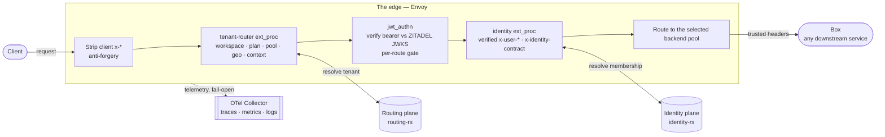

# Nexus

**The authoritative core for a multi-tenant edge platform.** Nexus owns routing, domain
lifecycle, identity enrichment, edge policy, and telemetry. Downstream backends ("boxes")
stay thin: they sit behind the edge and trust the headers it injects, because the edge is
the only network path that can reach them.

> One trust boundary, enforced at the edge. A request is authenticated, authorized against a
> workspace, and stamped with a verified identity context *before* it reaches any backend —
> so backends do authorization of *resources they own*, not of *who the caller is*.

---

## Architecture

Three planes plus one edge. Everything is Rust; the edge is stock Envoy driven by config.



| Plane | Repo dir | Does | Details |
| --- | --- | --- | --- |
| **Routing** | [`routing-rs/`](routing-rs/) | tenant → backend-pool routing, domain lifecycle + on-demand-TLS gate, Postgres-backed control plane, optional Redis L2 | [`routing-rs/README.md`](routing-rs/README.md) |
| **Identity** | [`identity-rs/`](identity-rs/) | authenticate the caller, resolve workspace membership, inject the verified identity stamp | [`identity-rs/README.md`](identity-rs/README.md) |
| **Edge** | [`edge/`](edge/) | the Envoy config that strips client headers, calls the ext_proc planes, and enforces the trust boundary | `edge/envoy.yaml` |

`routing-rs` and `identity-rs` are **independent Cargo workspaces** (no root `Cargo.toml`) —
each builds, tests, and releases on its own.

## What it guarantees

The behavior contracts live in [`openspec/specs/`](openspec/specs/) (language-agnostic
*what*), one capability per directory:

- **`workspace-tenancy`** — accounts own workspaces; stable-ID, transferable addressing.
- **`identity-workspace-authz`** — authorize a verified subject against a workspace; emit acting scope.
- **`membership-projection-sync`** — converge identity membership into the routing store (seconds + reconcile).
- **`edge-auth-gate`** — per-route auth (required/optional/reject), fail-safe on signal loss.
- **`edge-origin-trust`** — backends reachable only via the edge (this makes the injected headers unforgeable).
- **`edge-trust-anchor-integrity`** — JWKS over a tamper-proof channel, fail-closed.
- **`edge-request-tracing`** — the edge is the sole root of W3C trace context; head-sampling.
- **`http-request-resilience`** — bounded per-request time.
- **`box-telemetry-contract` / `first-party-telemetry` / `telemetry-cost-controls`** — one OTLP egress for traces/metrics/logs; retention + cost ceilings.

## Repo map

```
identity-rs/      identity plane (Cargo workspace)
routing-rs/       routing plane (Cargo workspace)
edge/             Envoy edge config (the trust boundary)
deploy/           Helm charts (production) + compose (staging/dev)
monitoring/       grafana / loki / tempo / prometheus / otel-collector / seaweedfs
scripts/          e2e assertions, helm guards, and the load/capacity harness (scripts/load/)
docs/             operator/consumer docs (start with box-consumer-contract.md)
openspec/         specs (what) + change history; the development workflow
docker-compose.yaml   the full local test lab (edge + ZITADEL + stores + monitoring)
nexus-upstream-requirements.md   CANONICAL cross-repo contract with downstream consumers
```

## Quickstart (local lab)

Boots the full reference topology — edge, a ZITADEL IdP, both stores, and the monitoring
stack — with the edge on `:10000`:

```sh
docker compose up -d

# prove the edge's trust contract end-to-end (anonymous paths, no token needed):
scripts/tenancy-edge-e2e.sh

# capacity check (needs k6 — see scripts/load/README.md):
scripts/load/run-load.sh
```

## Deploy

Two paths, [`deploy/README.md`](deploy/README.md) has the details:

- **Helm / Kubernetes — the production path.** Non-root + read-only-rootfs + `cap_drop: ALL`,
  resource limits, fail-closed origin-enforcement NetworkPolicies, `existingSecret`
  everywhere. Ship this, and walk the **production deployment checklist** in that README (the
  charts enforce the *choice*; you supply the *truth* — real origin enforcement, JWKS over
  verified TLS, pinned images, HA stores, capacity validation).
- **docker-compose** ([`deploy/compose/`](deploy/compose/)) — staging / single-node / dev.
  See [`TODO.md`](TODO.md) for the items that keep it off the HA-public path.

## Consuming Nexus (building a box)

If you're building a backend that sits behind the edge, read
[`docs/box-consumer-contract.md`](docs/box-consumer-contract.md) — every injected header, the
origin-trust prerequisite, the reject rules, and the telemetry contract — and the canonical
[`nexus-upstream-requirements.md`](nexus-upstream-requirements.md).

## Development

All work runs through **OpenSpec** with an abstraction-layer discipline and a build-vs-adopt
gate. The pipeline is `explore → propose → decide → apply → sync → archive`; the rules live in
[`CLAUDE.md`](CLAUDE.md), [`openspec/config.yaml`](openspec/config.yaml), and
[`openspec/guidelines.md`](openspec/guidelines.md). Separate the layers: `specs/` is *what*,
`design.md` is *how*, code is *do*.

## Status

All planned OpenSpec work is complete and archived (including an explicit
`production-readiness-gate` change). CI runs `cargo test` for both workspaces against a real
Postgres, clippy at deny-level, `cargo-deny`, Helm lint + fail-closed guard assertions, and a
full auth-enabled e2e release gate against the reference stack. Production readiness on the
Helm path is **conditional on the operator checklist** in [`deploy/README.md`](deploy/README.md).

## License

MIT (per-plane; see each plane's `README.md`).
