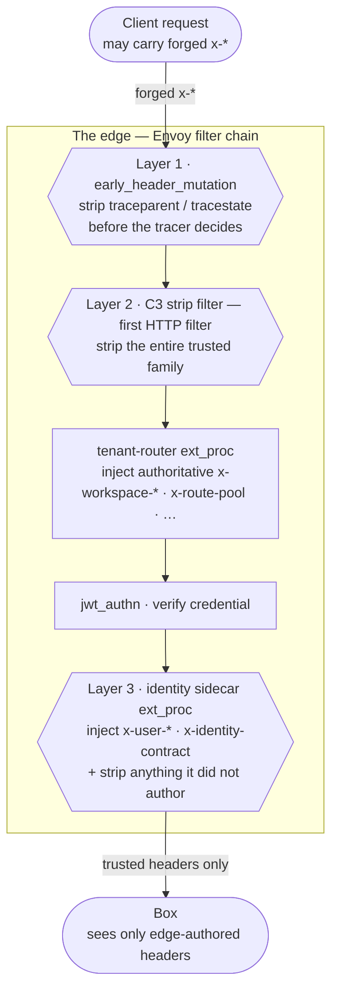

# Box consumer contract

**Audience:** anyone building or operating a "box" — a backend that sits behind the nexus
edge (any Python/Node/Go/… service). This is the complete wire reference for
the trusted headers the edge injects and what your box must do with them.

This document is the **header-level companion** to the canonical
[`nexus-upstream-requirements.md`](../nexus-upstream-requirements.md) (which owns the
cross-repo narrative and status). Where the requirements doc lists the identity subset, this
page enumerates **every** injected header with its exact format. Behavioral authority lives in
the specs: `openspec/specs/identity-workspace-authz`, `edge-origin-trust`, `edge-auth-gate`,
`edge-request-tracing`, and `box-telemetry-contract`.

---

## 0. The one prerequisite that makes everything else safe

**Your box MUST be reachable only through the edge.** The trusted headers below are
unforgeable *because of the network path* — the edge strips every client-supplied copy of
these headers (§3) and re-injects its own, so the only way a header can carry a value is if
the edge put it there. That guarantee holds **only** while the box's ingress is restricted to
the edge.

Since `identity-contract-signing`, the `x-identity-contract` header is *additionally* a
**signed token** you can cryptographically verify (§1a-bis) — a defense-in-depth proof that
the request was authored by nexus. **This does not replace the network control:** origin trust
remains the primary boundary, and you MUST still restrict ingress to the edge. The signature is
a second gate, not a substitute for the first.

- In Kubernetes: a `NetworkPolicy` (enforced by your CNI) that allows box ingress only from
  the edge pods. The Helm charts ship this fail-closed — see
  [`deploy/README.md`](../deploy/README.md) and `networkpolicy-backend.yaml`.
- Anywhere else: an equivalent, inspectable control (security group, mesh authz, etc.).

Absence of this control is a **misconfiguration, not a default-safe state**
(`edge-origin-trust/spec.md`). If your box is reachable directly, a client can forge every
header on this page.

---

## 1. Headers the edge injects (complete reference)

All values are **raw ASCII strings** — no JWT, no base64, no JSON. Plural fields are
comma-joined. Two planes author headers; the identity sidecar runs **last**, so its identity
headers are authoritative over any earlier copy.

### 1a. Identity — authored by the identity sidecar (`identity-rs/sidecar`)

Emitted on **every** enriched request, including the anonymous/no-credential path, so your box
must **never infer state from a header's absence** — read the explicit flag instead.

The other identity headers below (`x-user-*`, `x-auth-*`) are raw ASCII and are still emitted
on **every** enriched request. `x-identity-contract` is the exception — it is now a signed
token minted **only** for a resolved identity (§1a-bis).

| Header | Meaning | Format | Box uses it for |
| --- | --- | --- | --- |
| `x-identity-contract` | **The signed contract.** An ES256 JWS whose claims carry the acting identity; the contract-shape version rides inside as the `ctr` claim. Minted only for an authenticated member (§1a-bis). | compact JWS (`h.p.s`) | **Verify + require** (§1a-bis, §2). |
| `x-workspace-id` | The **authorized acting workspace** (set only after a live membership check). | id string | Primary tenant scope. Prefer over legacy `x-tenant-id`. |
| `x-workspace-plan` | The acting workspace's **plan tier** (`workspace-plan-tier`) — **nexus-authored** from nexus's own workspace record, never a client hint. Authored alongside the acting scope; **omitted** (not defaulted) when no plan resolves. Also carried in the signed contract's `plan` claim. | string (e.g. `free`, `pro`) | Storage-cap / feature policy. **Absent ⇒ treat as not-provisioned** (grant no tier). |
| `x-user-id` | Verified subject (`sub` for a user; the **service id** for a service; the **key id** for an api-key principal). | id string | Audit / ownership checks. |
| `x-user-on-behalf-of` | **Only for an `apikey` principal:** the **creating user** the key acts for (customer-api-keys). Authored alongside the acting scope; **absent** for a human/service. | id string | Audit / attribution to the human behind the automation. |
| `x-user-type` | Acting **principal kind / relationship**. `staff`/`customer` for a human (and for an **api-key**, the creator's relationship in the acting workspace); **`service`** for a core platform service (normalized-principal). | `staff` \| `customer` \| `service` | Acting-scope decisions; branch the write door on `service`. |
| `x-user-role` | Workspace-scoped role (not global). **Absent for a `service`** (a service has no workspace role). | role string | Acting-scope decisions. |
| `x-user-roles` | Coarse global roles, **nexus-authored** (from the live Profile via the resolver — never the token or the OIDC provider; `nexus-native-authorization`). | comma-joined | Enrichment. |
| `x-user-entitlements` | Entitlements, nexus-authored (live Profile). | comma-joined | Feature checks. |
| `x-user-suspended` | Suspension flag, nexus-authored (always from live Profile — revocation-sensitive, effective within seconds). | `true` \| `false` | Hard block. |
| `x-user-enriched-by` | Provenance marker. | `identity-sidecar-rs` \| `identity-sidecar-rs:miss` | Diagnostics. |
| `x-auth-anonymous` | Is the caller anonymous. | `true` \| `false` | Branch on identity. |
| `x-auth-method` | Auth method used. | `bearer` \| `none` | Diagnostics / step-up. |

### 1a-bis. Verifying the signed `x-identity-contract` (identity-contract-signing)

`x-identity-contract` is a compact **ES256 JWS**. To verify it:

1. **Fetch + cache the JWKS** from nexus at `<identity-plane>/.well-known/jwks.json` (served
   on a dedicated public listener, port `9210`). Select the key by the token header's `kid`.
   Cache it and refresh on an unknown `kid` (keys rotate with overlap).
2. **Verify the signature** (ES256) against that key. Reject if it does not verify.
3. **Check the registered claims:**
   - `iss` — MUST equal the nexus issuer you were given (e.g. `https://identity.nexus`).
   - `aud` — MUST equal **your box's name** (the value nexus routes to you as `x-route-pool`,
     e.g. `evenout`). This scopes the token to you; a token minted for another box will not
     match. Reject on mismatch.
   - `exp` — MUST be in the future (allow a small clock-skew leeway, e.g. 60s). Tokens are
     short-lived and minted per request.
   - `ctr` — the contract version (replaces the old `vN` string). Reject a version you do not
     understand — this is the drift tripwire for the whole `x-user-*`/`x-workspace-*` shape.
4. **Read identity from the verified claims** if you wish: `sub`, `workspace_id`, `principal_kind`,
   `role`, `roles` (these mirror `x-user-id` / `x-workspace-id` / `x-user-type` / `x-user-role` /
   `x-user-roles`). For an **`apikey`** principal the claims additionally carry **`on_behalf_of`** (the
   creating user) — present only for `apikey`, mirroring `x-user-on-behalf-of`. The `plan` claim
   carries the acting workspace's **plan tier** (`workspace-plan-tier`), mirroring `x-workspace-plan`
   and signed alongside the rest of the identity — **omitted** (not defaulted) when no plan resolves,
   so treat an absent plan as **not-provisioned**.

**Minted only for a resolved identity.** nexus signs the token **only** when the request is
authenticated *and* the caller resolved to an **authority** — a workspace membership (user) or a
platform permission set (service). A non-member, an unregistered/inactive service, an anonymous
caller, or a caller nexus has no profile for carries **no** `x-identity-contract` at all (and
any client-supplied copy is stripped). So on an identity-enriched route, an absent or
unverifiable token means **reject** (fail closed) — nexus has already refused unauthorized
callers upstream; they never reach you with a valid contract.

### 1a-ter. The `principal_kind` claim — authorizing a service vs a human (normalized-principal)

The signed contract carries a nexus-authored **`principal_kind`** — one of `user`, `apikey`, or
`service` — so your box can authorize on **what authenticated**, not only on role. It is
authoritative and **never** client-assertable (it comes from the verified credential + nexus's own
resolution; a forged `x-user-type` header is stripped).

| `principal_kind` | What it is | Contract claim shape | How a box typically authorizes it |
| --- | --- | --- | --- |
| `user` | A human end-user (OIDC). | `member_type` + `role` + `roles`; no `permissions`. | Gate by role/entitlement as today. |
| `service` | A **core platform service** authenticated by infrastructure trust (e.g. a K8s ServiceAccount token) — the legitimate **event writer**. | `workspace_id` (the acting workspace) + **`permissions`** (a least-privilege named set, e.g. `["events:write"]`); **no** `member_type`/`role`. | Admit as a **writer** iff `permissions` contains the operation you require. |
| `apikey` | Customer automation — a **Personal Access Token** issued by a human, acting **on behalf of** them (customer-api-keys). | `sub` is the **key id**; `member_type` + `role` are the creator's, in the acting workspace, **bounded by the key's scopes** (the key's authority = the creator's LIVE membership ∩ the key's scopes, so it never exceeds the creator and follows their revocation); **`on_behalf_of`** names the creating user; no coarse `roles`, no `permissions`. | Treat like the user it acts for, already bounded by scope. Attribute the action to **both** the key (`sub`) and the human (`on_behalf_of`). |

**An `apikey` contract** conveys the api-key kind, the key id as `sub`, the intersected acting
`workspace_id` + `member_type`/`role`, and `on_behalf_of` (the creating user). Revocation is live and
fail-closed: revoking or expiring a key — or revoking the **creator's** membership — denies the key's
next request within seconds (it resolves to no authority → no contract). The raw `x-api-key` credential
the client presents is **stripped at the sidecar** and never reaches your box.

A **service** contract conveys the service kind, the acting `workspace_id`, and the platform
`permissions` — and deliberately claims **no** workspace `member_type` or `role`. Authorize it by
its permissions (least-privilege): perform an operation only if the required permission is present,
even for an otherwise-authenticated, registered service. A service acts on **one** workspace per
request (the `workspace_id` claim), taken from nexus's trusted routing context — never
service-supplied. Revocation is live: revoking or de-registering a service denies its next request
within seconds.

**No legacy string form.** `x-identity-contract` is a signed JWS — there is no plain-string
(`v1`) variant to fall back to. If it is present, verify it; if it is absent on an enriched
route, reject (fail closed). The raw `x-user-*` headers are still emitted alongside it (you may
read identity from either), and origin trust (§0) remains the underlying guarantee.

### 1b. Tenant / routing — authored by the tenant-router (`routing-rs/tenant-router`)

| Header | Meaning | Format |
| --- | --- | --- |
| `x-workspace-features` | Enabled feature flags. | comma-joined |
| `x-route-pool` | Backend pool the edge routed to. | `api` \| `checkout` \| `assets` \| `application` |
| `x-routed-by` | Provenance marker. | literal `tenant-router` |

> **`x-workspace-plan` is authored by the identity sidecar (§1a), not here** — it is a
> nexus-owned fact keyed by the *authorized acting* workspace and is also signed into the
> contract's `plan` claim. Read it as an identity header, not a routing hint.

`x-workspace-id` is also authored here first, then **re-asserted or stripped** by the sidecar
after the membership check — treat the sidecar's value as authoritative.

### 1c. Geo context — `x-geo-*` (only when Cloudflare fronted the request)

Present only if the request arrived via Cloudflare (mapped from `cf-*`). Absent otherwise —
do not require them.

`x-geo-source` (literal `cloudflare`), `x-geo-country`, `x-geo-continent`, `x-geo-region`,
`x-geo-city`, `x-geo-postal-code`, `x-geo-timezone`, `x-geo-latitude`, `x-geo-longitude`,
`x-geo-client-ip`. Formats: ISO country/continent codes, normalized text, decimal coords.

### 1d. Request context (derived from client request, always present)

`x-locale` / `x-lang` (BCP-47 from `Accept-Language`), `x-currency` (ISO-4217, derived from
country), `x-privacy-gpc` / `x-privacy-dnt` (`true`/`false` from `Sec-GPC` / `DNT`),
`x-device-type` (`mobile` \| `desktop` \| `unknown`).

### 1e. Tracing

`traceparent` / `tracestate` — W3C trace context, **always edge-rooted**. Client copies are
stripped before Envoy makes its head-sampling decision; the sampled flag *is* the edge's
decision. See §4.

### Non-authoritative / retired — do not rely on

| Header | Status |
| --- | --- |
| `x-requested-workspace` | Client **hint**, deliberately *not* stripped. Never authoritative, never affects emitted scope. Ignore for authz. |
| `x-tenant-id` | Legacy read-fallback only. Pin the rename to `x-workspace-id`. |
| `x-user-org` | **Retired.** Never authored; always stripped. |
| `x-auth-required`, `x-auth-requires-role`, `x-auth-requires-entitlement`, `x-auth-min-aal` | **Edge-internal.** Stripped at the sidecar; never reach your box (see §2 rule 3). |

---

## 2. What your box MUST do

1. **Require and validate `x-identity-contract` on every identity-enriched route.** Reject
   (fail closed) if it is absent or an unrecognized version. A valid `vN` request by
   definition carries the acting `x-workspace-id` + `x-user-type`; a same-version request
   missing acting scope is invalid — reject it. There is no standalone acting-scope header.
2. **Fail closed by default.** Treat *every* route as enriched (require the stamp) unless a
   route is *explicitly* designated non-enriched (public/degradable). At the edge, the
   `/public` prefix is the only such designation (ext_proc disabled). Do not invert this — an
   undesignated route missing the stamp is an error, not a public request.
3. **Never trust the `x-auth-*` policy signals.** `x-auth-required` / `x-auth-requires-*` /
   `x-auth-min-aal` are the *edge's* per-route gate inputs. They are stripped at the sidecar
   and never reach you. Role/plan/AAL gating is the edge's job (it returns 401/403 before your
   box is reached). Your box keeps only **resource-ownership** checks — "does *this* user own
   *this* order" — which the edge cannot know.
4. **Read `x-workspace-id`, not `x-tenant-id`,** as the acting workspace. Read `x-user-id`
   for audit and `x-user-type` / `x-user-role` for the acting relationship.
5. **The stamp is version-drift coordination, not an auth boundary.** Its presence is not
   proof of edge origin — §0's network control is. When the header shape changes, `v1`→`v2`
   is bumped in both repos together.

---

## 3. Why the headers are trustworthy: the strip (anti-forgery)

The edge removes all client-supplied copies of the trusted family in **three independent
layers** (hexagons below), so a forged inbound header cannot survive to your box:



Both ext_proc filters (`tenant-router`, `identity sidecar`) run `failure_mode_allow: false`,
so a plane failure **fails closed** — the request is rejected, never forwarded unstripped.

1. **Early header mutation** — `traceparent` / `tracestate` are removed *before* Envoy's
   tracer makes its root-vs-join decision, so a forged `traceparent` can't graft the request
   onto a client-rooted trace.
2. **The C3 strip filter** — the first HTTP filter, running before any resolution, removes the
   entire trusted family (`x-workspace-*`, `x-route-pool`, `x-routed-by`, all `x-geo-*`, the
   `x-locale`/`x-currency`/`x-privacy-*`/`x-device-type` family, all `x-user-*`, `x-auth-*`,
   `x-identity-contract`, and `traceparent`/`tracestate` again).
3. **Sidecar defense-in-depth** — the identity sidecar adds to its own remove-list any
   identity header it does not author on the current path, independent of Envoy's filter
   order.

> **Maintainer note — keep the two edge configs in sync.** `edge/envoy.yaml` (lab) and
> `deploy/compose/envoy/envoy.yaml` (compose) strip the *same* header list — this is a
> maintained invariant (39 `remove:` entries, identical in both). When you add or remove a
> trusted header, update **both** files. Verify with:
>
> ```sh
> diff <(grep -oE -- '- remove: "[^"]+"' edge/envoy.yaml | sort -u) \
>      <(grep -oE -- '- remove: "[^"]+"' deploy/compose/envoy/envoy.yaml | sort -u)
> ```

---

## 4. Tracing (fail-open)

- **Continue** the edge-rooted `traceparent` when present; root a new trace only when absent.
- **No box-side tail sampling** — the edge already made the head decision.
- Telemetry is **fail-open**: a collector/store outage never affects request handling.

---

## 5. Telemetry: what your box emits

nexus exposes **one** telemetry endpoint — the OTel Collector, accepting **traces, metrics,
and logs** over OTLP (gRPC `:4317` / HTTP `:4318`). Your box knows only this endpoint; the
collector alone knows the stores (traces → Tempo, metrics → Prometheus, logs → Loki).

**Onboarding is one env var:** run standard OTel SDK / auto-instrumentation and set
`OTEL_EXPORTER_OTLP_ENDPOINT=<collector>`. Unset ⇒ telemetry off, fail-open.

A compliant box emits (full spec: `box-telemetry-contract/spec.md`):

- **Resource identity** on every signal — `service.name`, `service.version`,
  `deployment.environment.name` — identical across traces/metrics/logs.
- **Traces:** continue the edge-rooted `traceparent`; no tail sampling.
- **Logs:** structured + severity-tagged, stamped with the active `trace_id` / `span_id`
  during a traced request (enables the logs↔traces pivot).
- **RED metrics:** rate, errors, duration as an **aggregatable histogram** (so fleet-wide
  p50/p95/p99 are computable across replicas). Metrics MUST be independent of trace
  sampling — deriving them from sampled traces is a defect.
- **PII hygiene:** no credentials, no bodies, no user identifiers beyond the permitted
  trusted-header set, in any span attribute, metric label, or log field.

Collector-side cost guards (metric-attribute allow-list, per-stream log rate limits,
retention: traces 48h / logs 7d / metrics 15d) mean a misbehaving box degrades only its own
telemetry.

---

## 6. Open box-side action (N5)

Nexus already emits `x-identity-contract: v1`. Boxes that still gate on a `x-tenant-scope ==
acting` check must switch to the **`x-identity-contract` version check** described in §2. This
is the remaining consumer-side work; the edge side is shipped.
